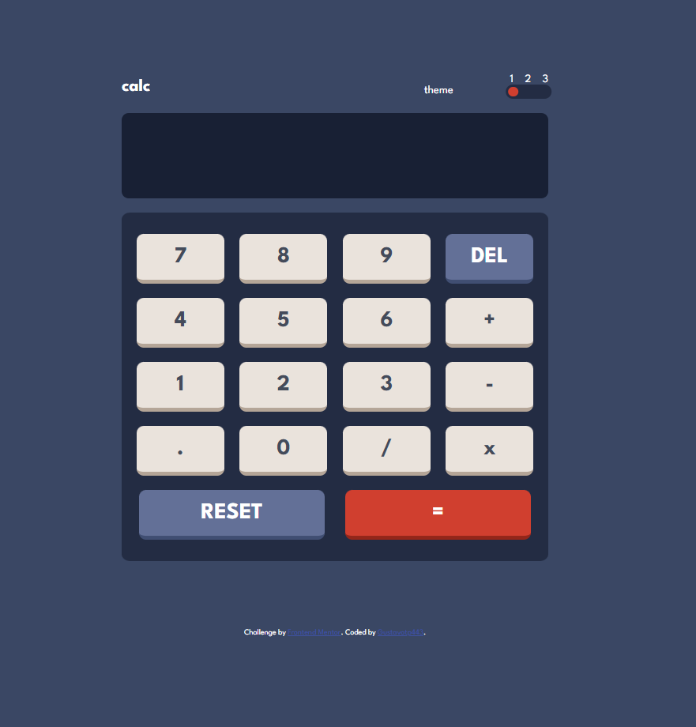

# Frontend Mentor - Calculator app solution

Essa é uma solução para a [Calculator app challenge on Frontend Mentor](https://www.frontendmentor.io/challenges/calculator-app-9lteq5N29). Um desafio do Frontend Mentor para ajudar a melhorar minha habilidades criando projetos realistas.

## Tabela de Conteúdo

- [Resumo](#resumo)
  - [Screenshot](#screenshot)
  - [Links](#links)
- [Meu processo](#meu-processo)
  - [Contruido com](#contruido-com)
- [Autor](#author)
- [Conhecimentos](#acknowledgments)

## Resumo

    Esse projeto foi de extrema importância para que eu conhecesse um pouco do Sass e melhorasse minhas habilidades com JavaScript Vanilla.

    Minha solução para esse desafio foi mapear um objeto contendo as informações dos temas e desenvolver uma função que percorre-se esse objeto sempre que eu clicasse no botão toggle de tema, assim alterando as variáveis pré-definidas no stylesheet.

    Já para o cálculo apliquei um evento de click nos botões assim executando funções em que eu acessava o valor da tela de resultado e alterava seu innerHTML conforme o evento. Para o cálculo em si apenas peguei os valores presentes na screen e apliquei o método de eval().

### Screenshot

### Links

- Solution URL: [Github Solution](https://your-solution-url.com)
- Live Site URL: [Add live site URL here](https://your-live-site-url.com)

## Meu processo

### Contruido com

- HTML marcações semânticas
- CSS custom properties
- Flexbox
- Sass, pré-processador de CSS
- JavaScript

## Autor

- Website - [GustavoTP443](https://gustavo-pardini-dev.vercel.app/)

## Conhecimentos

Estou em busca de uma oportunidade para ingressar no mercado de trabalho. Possuo conhecimentos em :

- HTML5
- CSS3
- SASS
- JavaScript
- ReactJS
- NodeJS
- TypeScript
- SQL
